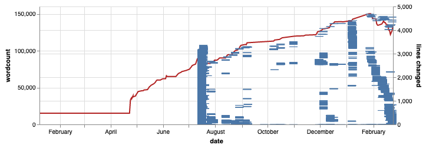

# graph-git-doc

Analyze git repo of _Project Unicorn_ manuscript, and graph daily word
count and the lines changed in the generated Markdown manuscript.

This program uses as input:

- [clj-jgit](https://github.com/clj-jgit/clj-jgit) library to get list of all commit hashes
- [archaeologist](https://github.com/wildbit/archaeologist) library to get file versions at each commit (to get number of lines)
- output of `git log --patch-with-stat --unified=1 manuscript.mmd` to get list of all lines changed upon each commit
- exported daily work log in CSV format

This program uses the fantastic [oz](https://github.com/metasoarous/oz) library to generate the vega-lite diagrams.

## Usage

- go into ozdemo namespace
- in REPL, run `(oz/v! (composite-graph))`

## License

Copyright © 2019 Gene Kim

This program and the accompanying materials are made available under the
terms of the Eclipse Public License 2.0 which is available at
http://www.eclipse.org/legal/epl-2.0.

This Source Code may also be made available under the following Secondary
Licenses when the conditions for such availability set forth in the Eclipse
Public License, v. 2.0 are satisfied: GNU General Public License as published by
the Free Software Foundation, either version 2 of the License, or (at your
option) any later version, with the GNU Classpath Exception which is available
at https://www.gnu.org/software/classpath/license.html.
